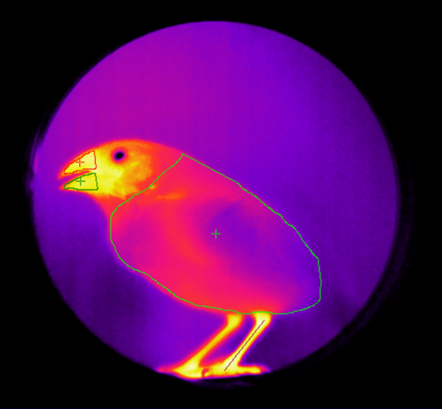
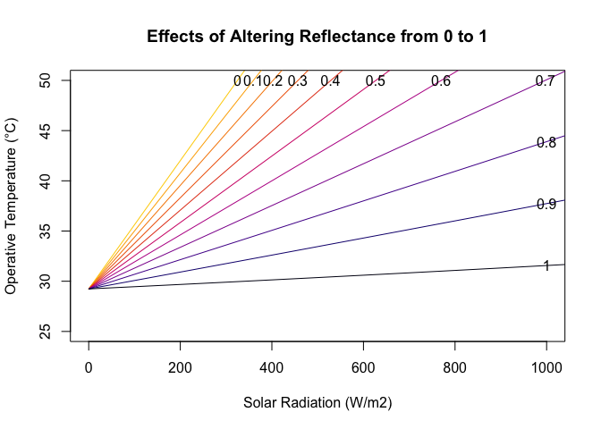
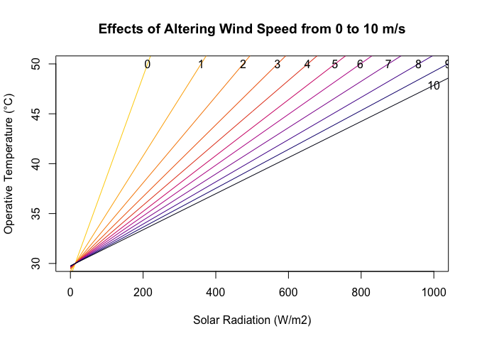
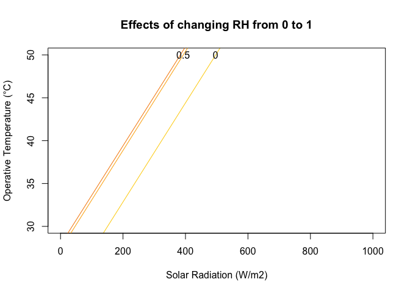
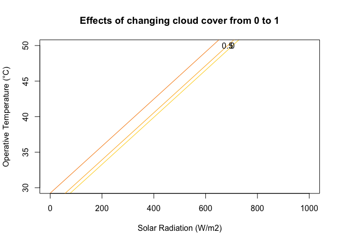

Estimating heat exchange from thermal images
================

The purpose of this file is to provide an introduction to estimating heat exchange from animal-based thermal images using the R Package, Thermimage.

It is assumed that the user has thermal imaging experience and has extracted thermal data from thermal images already, or has a means to bring thermal image data into R.

This package will not replace thermal image analysis software nor should it replace working knowledge of biophysical modelling, but it can help in automating some calculations associated with large datasets of thermal images.

This help file assumes the user already has captured and analysed thermal images, like the following image, isolating surface temperatures for key regions of interests (ROI analysis).



### Getting Started: Install Thermimage

If you don't have Thermimage installed, type:

``` r
library(devtools)
install_github("gtatters/Thermimage")
```

    ## Downloading GitHub repo gtatters/Thermimage@master
    ## from URL https://api.github.com/repos/gtatters/Thermimage/zipball/master

    ## Installing Thermimage

    ## '/Library/Frameworks/R.framework/Resources/bin/R' --no-site-file  \
    ##   --no-environ --no-save --no-restore --quiet CMD INSTALL  \
    ##   '/private/var/folders/0f/_hbgzdkx3pl6bvs35cm_dr1h0000gn/T/RtmpN4L2Um/devtools153cf4dfacae1/gtatters-Thermimage-959fd8c'  \
    ##   --library='/Library/Frameworks/R.framework/Versions/3.4/Resources/library'  \
    ##   --install-tests

    ## 

This should download the most recent version of Thermimage from github repository and install it. Then simply type library(Thermimage) to call the functions into the working environment:

``` r
library(Thermimage)
```

### Minimum required information

Before getting started ensure you have the following information available:

-   Surface temperatures, Ts (degrees C - note: all temperature units are in degrees C): obtain from the thermal image.
-   Ambient temperatures, Ta (degrees C): usually meausred independently with a thermometer
-   Characteristic dimension of the object or animal, L (m)
-   Surface Area, A (m^2)
-   Shape of object: choose from "sphere", "hcylinder", "vcylinder", "hplate", "vplate"

Required if working outdoors with solar radiation
-------------------------------------------------

-   Surface reflectance, rho, which could be measured or estimated (0-1): an average reflectance of short-wave, mostly visible light
-   Solar radiation (SE=abbrev for solar energy), W/m2
-   Cloud cover (from 0 to 1), an estimate of fractional cloud coverage of sky

Can be estimated or provided through functions in Thermimage:
-------------------------------------------------------------

-   Ground Temperature, Tg (degrees C) - estimated from air temperature if not provided
-   Incoming infrared radiation, Ld (W/m^2; will be estimated from Air Temperature)
-   Incoming infrared radiation, Lu (W/m^2; will be estimated from Ground Temperature)
-   Wind speed, V (m/s) - I tend to model heat exchange under different V (0.1 to 10 m/s)
-   Type of convective heat exchange to be modelled (free or forced)
-   Convection coefficients (c, n, a, b, m)

### Ground Temperature Estimation and Incoming Infrared Radiation

If missing ground temperature (Tg) information, we have derived a relationship based on empirical data collected using thermal imaging in Galapagos that describes Tg as a function of Ta and Solar Radiation:

Tg-Ta ~ Se, (N=516, based on daytime measurements)

Range of Ta: 23.7 to 34 C. Range of SE: 6.5 to 1506.0 Watts/m^2

which yielded the following relationship:

Tg = 0.0187128\*SE + Ta

Alternatively, published work by Bartlett et al. (2006) in the Tground() function, found the following relationship:

Tg = 0.0121\*SE + Ta

Incoming infrared radiation is modelled as deriving from two sources: sky (Ld) and ground (Lu). Half of the incoming is assumed to be from the sky and half from the ground. Sky radiation is influenced by cloud cover, cloud emissivity, and sky temperature, ground radiation is influenced by ground temperature. The two functions Ld() and Lu() estimate these sources of radiation.

### Wind Speed and Convective Heat Exchange Assumptions

Wind speed should be measured but is usually highly variable when measured. One alternative is to model it under different scenarios. Free convection is applied in still air (wind speed = 0). Forced convection is for wind speed &gt; 0.

It might be sufficient to model convection in low air flow conditions (&lt;=0.1 m/s) using forced convection with wind speed set to 0.1.

The shape is determined by the user, estimating the best approximation of sphere, cylinder, or plate.
The convection parameters are highlighted in references contained in Thermimage, but can be found in Gates (2003) Biophysical Ecology.

Assemble data into a data frame
-------------------------------

Once you have decided on what variables you have or need to model, create a data frame with these values (Ta, Ts, Tg, SE, A, L, Shape, rho), where each row corresponds toan individual measurement. The data frame is not required for calling functions, but it will force you to assemble your data and find missing values before proceeding with calculations.

Other records such as size, date image captured, time of day, species, sex, etc...should also be stored in the data frame.

Here is a random data set:

``` r
Ta<-rnorm(20, 25, sd=10)
Ts<-Ta+rnorm(20, 5, sd=1)
RH<-rep(0.5, length(Ta))
SE<-rnorm(20, 400, sd=50)
Tg<-Tground(Ta,SE)
A<-rep(0.4,length(Ta))
L<-rep(0.1, length(Ta))
V<-rep(1, length(Ta))
shape<-rep("hcylinder", length(Ta))
c<-forcedparameters(V=V, L=L, Ta=Ta, shape=shape)$c
n<-forcedparameters(V=V, L=L, Ta=Ta, shape=shape)$n
a<-freeparameters(L=L, Ts=Ts, Ta=Ta, shape=shape)$a
b<-freeparameters(L=L, Ts=Ts, Ta=Ta, shape=shape)$b
m<-freeparameters(L=L, Ts=Ts, Ta=Ta, shape=shape)$m
type<-rep("forced", length(Ta))
rho<-rep(0.1, length(Ta))
cloud<-rep(0, length(Ta))
d<-data.frame(Ta, Ts, Tg, SE, RH, rho, cloud, A, V, L, c, n, a, b, m, type, shape)
head(d)
```

    ##         Ta       Ts       Tg       SE  RH rho cloud   A V   L     c     n
    ## 1 12.22503 15.15419 17.98821 476.2959 0.5 0.1     0 0.4 1 0.1 0.174 0.618
    ## 2 18.10625 24.91881 22.35742 351.3360 0.5 0.1     0 0.4 1 0.1 0.174 0.618
    ## 3 27.15160 32.99247 33.08919 490.7101 0.5 0.1     0 0.4 1 0.1 0.174 0.618
    ## 4 35.86914 40.79612 39.85561 329.4608 0.5 0.1     0 0.4 1 0.1 0.174 0.618
    ## 5 25.52482 32.17084 29.85964 358.2489 0.5 0.1     0 0.4 1 0.1 0.174 0.618
    ## 6 18.52938 22.34500 22.59713 336.1774 0.5 0.1     0 0.4 1 0.1 0.174 0.618
    ##   a    b    m   type     shape
    ## 1 1 0.58 0.25 forced hcylinder
    ## 2 1 0.58 0.25 forced hcylinder
    ## 3 1 0.58 0.25 forced hcylinder
    ## 4 1 0.58 0.25 forced hcylinder
    ## 5 1 0.58 0.25 forced hcylinder
    ## 6 1 0.58 0.25 forced hcylinder

Basic calculations
------------------

The basic approach to estimating heat loss is based on that outlined in Tattersall et al (2009) and Tattersall et al (2017). The approach involves breaking the object into component shapes, deriving the exposed areas of those shapes empirically, and calcuating Qtotal for each shape:

``` r
(Qtotal<-qrad() + qconv()) # units are in W/m2
```

    ## [1] -186.8849

Notice how the above example yielded an estimate. This is because there are defaultvalues in all the functions. In this case, the estimate is negative, meaning a net loss of heat to the environment. It's units are in W/m2.

To convert the above measures into total heat flux, the Area (m2) of each part is required. This is the largest source of error in any morphometric analysis and beyond the scope of this package.

``` r
Area1<-0.2 # units need to be in m2
Area2<-0.3 # units need to be in m2
(Qtotal1<-qrad()*Area1 + qconv()*Area1)
```

    ## [1] -37.37699

``` r
(Qtotal2<-qrad()*Area2 + qconv()*Area2)
```

    ## [1] -56.06548

``` r
(QtotalAll<-Qtotal1 + Qtotal2)
```

    ## [1] -93.44246

If used comprehensively across the entire body's thermal image, component shapes should sum to estimate entire body heat exchange: WholeBody = Qtotal1 + Qtotal2 + Qtotal3 ... Qtotaln

### Qtotal is made up of two components: qrad + qconv

qrad is the net radiative heat flux (W/m2).

qconv is the net convective heat flux (W/m2)

conductive heat flux (W/m2), or qcond is often ignored unless a large contact area exists between substrate.

Additional information is required to accurately calculate conductive heat exchange and are not provided here, since thermal imaging would not capture the temperature.

### What is qabs()?

qabs = absorbed radiation (W/m2). Radiation is both absorbed and emitted by animals. I have broken this down into partially separate functions.
qabs() is a function to estimate the area specific amount of solar and infrared radiation absorbed by the object from the environment and requires information on the air (ambient) temperature, ground temperature, relative humidity, emissivity of the object, reflectivity of the object, proportion cloud cover, and solar energy.

``` r
qabs(Ta = 20, Tg = NULL, RH = 0.5, E = 0.96, rho = 0.1, cloud = 0, SE = 400)
```

    ## [1] 720.2545

compare to a shaded environment with lower SE, which yields a much lower value:

``` r
qabs(Ta = 20, Tg = NULL, RH = 0.5, E = 0.96, rho = 0.1, cloud = 0, SE = 100)
```

    ## [1] 440.2954

### What is qrad()?

qrad = net radiative heat flux (includes that absorbed and that emitted). Since the animal also emits radiation, qrad() provides the net radiative heat transfer. Here is an example, using the same parameters as the previous example, but calculating qrad based on a Ts=27 degrees C:

``` r
qrad(Ts = 27, Ta = 20, Tg = NULL, RH = 0.5, E = 0.96, rho = 0.1, cloud = 0, SE = 100)
```

    ## [1] -1.486309

Notice how the absorbed environmental radiation is ~440 W/m2, but the animal is also losing a similar amount, so once we account for the net radiative flux, it very nearly balances out at a slightly negative number (-1.486 W/m2)

### How to include Ground temperature?

If you have measured ground temperature, then simply include it in the call to qrad:

``` r
qrad(Ts = 30, Ta = 25, Tg = 28, RH = 0.5, E = 0.96, rho = 0.1, cloud = 0, SE = 100)
```

    ## [1] 14.29534

If you do not have ground temperature, but have measured Ta and SE, then set Tg=NULL. This will force a call to the Tground() function to estimate Tground. It is likely better to assume that Tground is slightly higher than Ta, at least in the daytime. If using measurements obtained at night (SE=0), then you will have to provide both Ta and Tground, since Tground could be colder equal to Ta depending on cloud cover.

### What is hconv()?

This is simply the convective heat coefficient, which depends on wind speed and your modelled mode of convective heat exchange (free or forced). This is used in calculating the convective heat transfer and/or operative temperature but usually you will not need to call hconv() yourself

### What is qconv()?

This is the function to calculate area specific convective heat transfer, analagous to qrad, except for convective heat transfer. Positive values mean heat is gained by convection, negative values mean heat is lost by convection. Included in the function is the ability to estimate free convection (which occurs at 0 wind speed) or forced convection (wind speed &gt;=0.1 m/s). Unless working in a completely still environment, it is more appropriate to used "forced" convection down to 0.1 m/s wind speed (see Gates Biophysical Ecology).

Typical wind speeds indoors are likely &lt;0.5 m/s, but outside can vary wildly.

In addition to needing surface temperature, air temperature, and velocity, you need information/estimates on shape. L is the critical dimension of the shape, which is usually the height of an object within the air stream. The diameter of a horizontal cylinder is its critical dimension. Finally, shape needs to be assigned. see help(qconv) for details.

Some examples:

``` r
qconv(Ts = 30, Ta = 20, V = 1, L = 0.1, type = "forced", shape="hcylinder")
```

    ## [1] -102.6565

``` r
qconv(Ts = 30, Ta = 20, V = 1, L = 0.1, type = "forced", shape="hplate")
```

    ## [1] -124.323

``` r
qconv(Ts = 30, Ta = 20, V = 1, L = 0.1, type = "forced", shape="sphere")
```

    ## [1] -186.3256

notice how the horizontal cylinder loses less than the horizontal plate which loses less than the sphere. Spherical objects lose ~1.8 times as much heat per area as cylinders.

### Which is higher: convection or radiation?

Take a convection estimate at low wind speed:

``` r
qconv(Ts = 30, Ta = 20, V = 0.1, L = 0.1, type = "forced", shape="hcylinder")
```

    ## [1] -32.58495

compare to a radiative estimate (without any solar absorption):

``` r
qrad(Ts = 30, Ta = 20, Tg = NULL, RH = 0.5, E = 0.96, rho = 0.1, cloud = 0, SE = 0)
```

    ## [1] -112.6542

In this case, the net radiative heat loss is greater than convective heat loss if you decrease the critical dimension, however, the convective heat loss per m2 is much greater. This is effectively how convective exchange works: small objects lose heat from convection more readily than large objects (e.g. think about frostbite that occurs on fingers and toes)

If L is 10 times smaller:

``` r
qconv(Ts = 30, Ta = 20, V = 0.1, L = 0.01, type = "forced", shape="hcylinder")
```

    ## [1] -111.4338

``` r
qrad(Ts = 30, Ta = 20, Tg = NULL, RH = 0.5, E = 0.96, rho = 0.1, cloud = 0, SE = 0)
```

    ## [1] -112.6542

convection and radiative heat transfer are nearly the same.

A safe conclusion here is that larger animals would rely more on radiative heat transfer than they would on convective heat transfer

Sample Calculations
-------------------

Ideally, you have all parameters estimated or measured and put into a data frame. Using the dataframe, d we constructed earlier

``` r
(qrad.A<-with(d, qrad(Ts, Ta, Tg, RH, E=0.96, rho, cloud, SE))) 
```

    ##  [1] 373.4393 234.6286 369.2614 224.0027 240.4368 237.4652 264.4358
    ##  [8] 312.0933 296.3560 350.5890 245.0032 355.3068 321.0396 257.4509
    ## [15] 243.9035 319.5909 279.3958 217.6691 336.9465 334.2372

``` r
(qconv.free.A<-with(d, qconv(Ts, Ta, V, L, c, n, a, b, m, type="free", shape)))
```

    ##  [1] -10.49320 -30.03727 -24.67624 -19.88495 -29.01901 -14.55066 -20.72045
    ##  [8] -19.69362 -23.87048 -18.48460 -26.96748 -14.48489 -23.90236 -21.13729
    ## [15] -20.89854 -12.24145 -22.96670 -30.11934 -29.79777 -20.05169

``` r
(qconv.forced.A<-with(d, qconv(Ts, Ta, V, L,  c, n, a, b, m, type, shape)))
```

    ##  [1] -30.37614 -70.10075 -59.46142 -49.70481 -67.78157 -39.24151 -51.78957
    ##  [8] -50.13293 -57.26548 -47.03136 -63.75500 -38.79341 -58.45417 -53.03130
    ## [15] -52.44368 -33.92124 -56.28807 -69.41974 -69.36761 -50.17441

``` r
qtotal<-A*(qrad.A + qconv.forced.A) # Multiply by area to obtain heat exchange in Watts
 
d<-data.frame(d, qrad=qrad.A*A, qconv=qconv.forced.A*A, qtotal=qtotal)
head(d)
```

    ##         Ta       Ts       Tg       SE  RH rho cloud   A V   L     c     n
    ## 1 12.22503 15.15419 17.98821 476.2959 0.5 0.1     0 0.4 1 0.1 0.174 0.618
    ## 2 18.10625 24.91881 22.35742 351.3360 0.5 0.1     0 0.4 1 0.1 0.174 0.618
    ## 3 27.15160 32.99247 33.08919 490.7101 0.5 0.1     0 0.4 1 0.1 0.174 0.618
    ## 4 35.86914 40.79612 39.85561 329.4608 0.5 0.1     0 0.4 1 0.1 0.174 0.618
    ## 5 25.52482 32.17084 29.85964 358.2489 0.5 0.1     0 0.4 1 0.1 0.174 0.618
    ## 6 18.52938 22.34500 22.59713 336.1774 0.5 0.1     0 0.4 1 0.1 0.174 0.618
    ##   a    b    m   type     shape      qrad     qconv    qtotal
    ## 1 1 0.58 0.25 forced hcylinder 149.37573 -12.15046 137.22527
    ## 2 1 0.58 0.25 forced hcylinder  93.85144 -28.04030  65.81114
    ## 3 1 0.58 0.25 forced hcylinder 147.70458 -23.78457 123.92001
    ## 4 1 0.58 0.25 forced hcylinder  89.60108 -19.88193  69.71915
    ## 5 1 0.58 0.25 forced hcylinder  96.17474 -27.11263  69.06211
    ## 6 1 0.58 0.25 forced hcylinder  94.98608 -15.69660  79.28948

### Test the equations out for consistency

Toucan Proximal Bill data at 10 degrees (from Tattersall et al 2009 spreadsheet calculations)

``` r
A<-0.0097169
L<-0.0587
Ta<-10
Tg<-Ta
Ts<-15.59
SE<-0
rho<-0.1
E<-0.96
RH<-0.5
cloud<-1
V<-5
type="forced"
shape="hcylinder"
(qrad.A<-qrad(Ts=Ts, Ta=Ta, Tg=Tg, RH=RH, E=E, rho=rho, cloud=cloud, SE=SE))
```

    ## [1] -37.90549

compare to calculated value of -28.7 W/m2 the R calculations differ slightly from Tattersall et al (2009) since they did not use estimates of longwave radiation (Ld and Lu), but instead assumed a simpler, constant Ta.

``` r
(qrad.A<-qrad(Ts=Ts, Ta=Ta, Tg=Tg, RH=RH, E=E, rho=rho, cloud=0, SE=SE))
```

    ## [1] -83.03191

but if cloud = 0, then the qrad values calculated here are much higher than calculated by Tattersall et al (2009) since they only estimated under simplifying, indoor conditions where background temperature = air temperature. In the outdoors, then, cloud presence would affect estimates of radiative heat loss.

``` r
(qconv.forced.A<-qconv(Ts, Ta, V, L, type=type, shape=shape))
```

    ## [1] -192.7086

compare to calculated value of -191.67 W/m2 - which is really close! The difference lies in estimates of air kinematic viscosity used.
Total area specific heat loss for the proximal area of the bill (Watts/m2)

``` r
(qtotal.A<-(qrad.A + qconv.forced.A))
```

    ## [1] -275.7405

Total heat exchange from the bill, including convective and radiative is:

``` r
qtotal.A*A
```

    ## [1] -2.679343

Total heat loss for the proximal area of the bill (Watts) can be as much as 2.6 Watts!
This lines up well with the published values in Tattersall et al (2009). This was confirmed in van de Van (2016) where they recalculated the area specific heat flux from toucan bills to be ~65 W/m2, but they used free convection estimates and so wind speed of 0 significantly reduces the estimated convective heat exchange:

``` r
qrad(Ts=Ts, Ta=Ta, Tg=Tg, RH=0.5, E=0.96, rho=rho, cloud=1, SE=0) + qconv(Ts, Ta, V, L, type="free", shape=shape)
```

    ## [1] -64.83292

Estimating Operative Temperature
--------------------------------

Operative environmental temperature is the expression of the "effective temperature" an object is experiencing, accounting for heat absorbed from radiation and heat lost to convection.

In other words, it is often used by some when trying to predict animal body temperature as a null expectation or reference point to determine whether active thermoregulation is being used. More often used in ectotherm studies, but as an initial estimate of what a freely moving animal temperature would be, it serves a useful reference.

Usually, people would measure operative temperature with a model of an object placed into the environment, allowing wind, solar radiation and ambient temperature to influence its temperature. There are numerous formulations for it. The one here is from Angilletta's book on Thermal Adaptations, and requires measurements of air temperature, ground temperature, SE, wind speed, relative humidity, emissivity, reflectance, cloud cover, and object shape and size.

Note: in the absence of sun or wind, operative temperature is simply ambient temperature.

### Model operative temperature with varying reflectances

``` r
Ts<-40
Ta<-30
SE<-seq(0,1100,100)
Toperative<-NULL
for(rho in seq(0, 1, 0.1)){
  temp<-Te(Ts=Ts, Ta=Ta, Tg=NULL, RH=0.5, E=0.96, rho=rho, cloud=1, SE=SE, V=1, 
           L=0.1, type="forced", shape="hcylinder")
  Toperative<-cbind(Toperative, temp)
}
rho<-seq(0, 1, 0.1)
Toperative<-data.frame(SE=seq(0,1100,100), Toperative)
colnames(Toperative)<-c("SE", seq(0,1,0.1))
matplot(Toperative$SE, Toperative[,-1], ylim=c(25, 50), type="l", xlim=c(0,1000),
        main="Effects of Altering Reflectance from 0 to 1",
        ylab="Operative Temperature (°C)", xlab="Solar Radiation (W/m2)", lty=1,
        col=flirpal[rev(seq(1,380,35))])
for(i in 2:12){
    ymax<-par()$yaxp[2]
    xmax<-par()$xaxp[2]  
    x<-Toperative[,1]; y<-Toperative[,i]
    lm1<-lm(y~x)
    b<-coefficients(lm1)[1]; m<-coefficients(lm1)[2]
    if(max(y)>ymax) {xpos<-(ymax-b)/m; ypos<-ymax}
    if(max(y)<ymax) {xpos<-xmax; ypos<-y[which(x==1000)]}
    text(xpos, ypos, labels=rho[(i-1)])
}
```



### Model operative temperature with varying wind speeds

``` r
Ts<-40
Ta<-30
SE<-seq(0,1100,100)
Toperative<-NULL
V<-c(0.1,1,2,3,4,5,6,7,8,9,10)

for(V in V){
  temp<-Te(Ts=Ts, Ta=Ta, Tg=NULL, RH=0.5, E=0.96, rho=0.1, cloud=1, SE=SE, V=V, 
           L=0.1, type="forced", shape="vcylinder")
  Toperative<-cbind(Toperative, temp)
}
V<-seq(0,10,1)
Toperative<-data.frame(SE=seq(0,1100,100), Toperative)
colnames(Toperative)<-c("SE", seq(0,10,1))
matplot(Toperative$SE, Toperative[,-1], ylim=c(30, 50), type="l", xlim=c(0,1000),
        main="Effects of Altering Wind Speed from 0 to 10 m/s",
        ylab="Operative Temperature (°C)", xlab="Solar Radiation (W/m2)", lty=1,
        col=flirpal[rev(seq(1,380,35))])
for(i in 2:12){
  ymax<-par()$yaxp[2]
  xmax<-par()$xaxp[2]  
  x<-Toperative[,1]; y<-Toperative[,i]
  lm1<-lm(y~x)
  b<-coefficients(lm1)[1]; m<-coefficients(lm1)[2]
  if(max(y)>ymax) {xpos<-(ymax-b)/m; ypos<-ymax}
  if(max(y)<ymax) {xpos<-xmax; ypos<-y[which(x==1000)]}
  text(xpos, ypos, labels=V[(i-1)])
}
```



### Model operative temperature with varying RH

``` r
Ts<-40
Ta<-30
SE<-seq(0,1100,100)
Toperative<-NULL
for(RH in seq(0, 1, 0.5)){
  temp<-Te(Ts=Ts, Ta=Ta, Tg=NULL, RH=RH, E=0.96, rho=0.1, cloud=0.5, SE=SE, V=1, 
           L=0.1, type="forced", shape="hcylinder")
  Toperative<-cbind(Toperative, temp)
}
RH<-seq(0, 1, 0.5)
Toperative<-data.frame(SE=seq(0,1100,100), Toperative)
colnames(Toperative)<-c("SE", seq(0,1,0.5))
matplot(Toperative$SE, Toperative[,-1], ylim=c(30, 50), type="l", xlim=c(0,1000),
        main="Effects of changing RH from 0 to 1",
        ylab="Operative Temperature (°C)", xlab="Solar Radiation (W/m2)", lty=1,
        col=flirpal[rev(seq(1,380,35))])
for(i in 2:3){
  ymax<-par()$yaxp[2]
  xmax<-par()$xaxp[2]  
  x<-Toperative[,1]; y<-Toperative[,i]
  lm1<-lm(y~x)
  b<-coefficients(lm1)[1]; m<-coefficients(lm1)[2]
  if(max(y)>ymax) {xpos<-(ymax-b)/m; ypos<-ymax}
  if(max(y)<ymax) {xpos<-xmax; ypos<-y[which(x==1000)]}
  text(xpos, ypos, labels=RH[(i-1)])
}
```



### Model operative temperature with varying cloud cover

``` r
Ts<-40
Ta<-30
SE<-seq(0,1100,100)
Toperative<-NULL
for(cloud in seq(0, 1, 0.5)){
  temp<-Te(Ts=Ts, Ta=Ta, Tg=NULL, RH=0.5, E=0.96, rho=0.5, cloud=cloud, SE=SE, V=1, 
           L=0.1, type="forced", shape="hcylinder")
  Toperative<-cbind(Toperative, temp)
}
cloud<-seq(0, 1, 0.5)
Toperative<-data.frame(SE=seq(0,1100,100), Toperative)
colnames(Toperative)<-c("SE", seq(0,1,0.5))
matplot(Toperative$SE, Toperative[,-1], ylim=c(30, 50), type="l", xlim=c(0,1000),
        main="Effects of changing cloud cover from 0 to 1",
        ylab="Operative Temperature (°C)", xlab="Solar Radiation (W/m2)", lty=1,
        col=flirpal[rev(seq(1,380,35))])
for(i in 2:3){
  ymax<-par()$yaxp[2]
  xmax<-par()$xaxp[2]  
  x<-Toperative[,1]; y<-Toperative[,i]
  lm1<-lm(y~x)
  b<-coefficients(lm1)[1]; m<-coefficients(lm1)[2]
  if(max(y)>ymax) {xpos<-(ymax-b)/m; ypos<-ymax}
  if(max(y)<ymax) {xpos<-xmax; ypos<-y[which(x==1000)]}
  text(xpos, ypos, labels=cloud[(i-1)])
}
```



### References

Angiletta, M. J. 2009. Thermal Adaptation: A Theoretical and Empirical Synthesis. Oxford University Press, Oxford, UK, 304 pp. Gates, D.M. 2003. Biophysical Ecology. Courier Corporation, 656 pp.

Blaxter, 1986. Energy metabolism in animals and man. Cambridge University Press, Cambridge, UK, 340 pp.

Gates, DM. 2003. Biophysical Ecology. Dover Publications, Mineola, New York, 611 pp.

Tattersall, GJ, Andrade, DV, and Abe, AS. 2009. Heat exchange from the toucan bill reveals a controllable vascular thermal radiator. Science, 325: 468-470.

Tattersall GJ, Chaves JA, Danner RM. Thermoregulatory windows in Darwin's finches. Functional Ecology 2017; 00:1–11. <https://doi.org/10.1111/1365-2435.12990>
